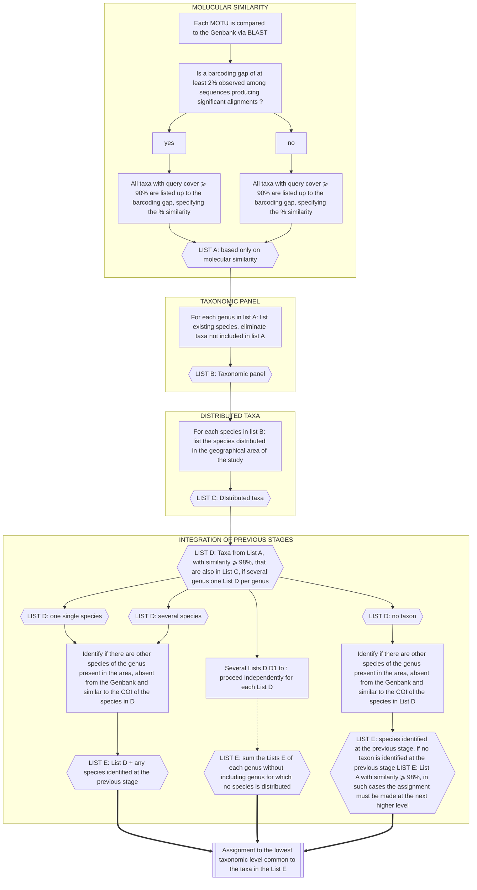

```mermaid
flowchart TB
subgraph A[MOLUCULAR SIMILARITY]
    1[Each MOTU is compared to the Genbank via BLAST] --> 2[Is a barcoding gap of at least 2% observed among sequences producing significant alignments ?]
    2[Is a barcoding gap of at least 2% observed among sequences producing significant alignments ?] --> yes --> 3[All taxa with query cover ⩾ 90% are listed up to the barcoding gap, specifying the % similarity]
    2[Is a barcoding gap of at least 2% observed among sequences producing significant alignments ?] --> no --> 4[All taxa with query cover ⩾ 90% are listed up to the barcoding gap, specifying the % similarity]
    3 --> 5{{"LIST A: based only on molecular similarity"}}
    4 --> 5
end
subgraph B[TAXONOMIC PANEL]
    5 --> 6[For each genus in list A: list existing species, eliminate taxa not included in list A]
    6 --> 7{{"LIST B: Taxonomic panel"}}
end
subgraph C[DISTRIBUTED TAXA]
    7 --> 8[For each species in list B: list the species distributed in the geographical area of the study]
    8 --> 9{{"LIST C: DIstributed taxa"}}
end
subgraph D[INTEGRATION OF PREVIOUS STAGES]
    9 --> 10{{"LIST D: Taxa from List A, with similarity ⩾ 98%, that are also in List C, if several genus one List D per genus"}} 
    10 --> 11{{"LIST D: one single species"}}
    10 --> 12{{"LIST D: several species"}}
    11 --> 13[Identify if there are other species of the genus present in the area, absent from the Genbank and similar to the COI of the species in D]
    12 --> 13
    13 --> 14{{"LIST E: List D + any species identified at the previous stage"}}
    10 --> 15[Several Lists D D1 to : proceed independently for each List D]
    15 -.-> 16{{"LIST E: sum the Lists E of each genus without including genus for which no species is distributed"}}
    10 --> 17{{"LIST D: no taxon"}}
    17 --> 18[Identify if there are other species of the genus present in the area, absent from the Genbank and similar to the COI of the species in List D]
    18 --> 19{{"LIST E: species identified at the previous stage, if no taxon is identified at the previous stage LIST E: List A with similarity ⩾ 98%, in such cases the assignment must be made at the next higher level"}}
end
    14 ==> 20[["Assignment to the lowest taxonomic level common to the taxa in the List E"]]
    16 ==> 20
    19 ==> 20
```
